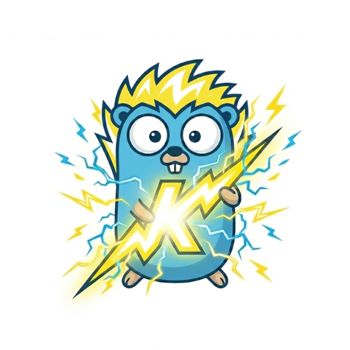

# KVolt ⚡ 

<p align="center">
  
</p>


**KVolt** is a high-performance, developer-friendly Go web framework built for speed and ease of use. It combines the raw power of `net/http` with a modern API, zero-allocation routing, and a suite of "Batteries Included" utilities.

## Features 🚀

*   **Extreme Performance**: **250,000+ Req/Sec** using `bytedance/sonic` for JSON serialization and `sync.Pool`.
*   **Radix Tree Router**: Smart routing with support for named parameters (`/users/:id`), wildcards, and regex.
*   **Static Assets**: Built-in support for serving static files (`app.Static()`) with correct prefix handling.
*   **Protocol Ready**: Native support for **HTTP/2** (`RunTLS`) and **WebSockets** (`c.Upgrade()`).
*   **Auto-Documentation**:
    *   Built-in **Scalar & Swagger UI** integration.
    *   Automatic route discovery and documentation generation (`app.Routes()`).
*   **Developer Experience (DX)**:
    *   **Hot Reload**: CLI support for auto-restart on code changes (`kvolt run`).
    *   **HTML Templates**: Robust support for layouts and partials.
    *   **Unit Testing**: Specialized `pkg/testkit` for blazing-fast handler tests.
*   **Middleware Ecosystem**:
    *   **Logger**: Asynchronous, non-blocking console logging.
    *   **Recovery**: Panic recovery to keep your server alive.
    *   **Gzip**: Automatic response compression.
    *   **CORS**: Configurable Cross-Origin Resource Sharing.
    *   **Rate Limiter**: Token-bucket strategy for API protection.
    *   **Secure Headers**: Protection against XSS, Clickjacking, and MIME sniffing (`middleware.Secure()`).
    *   **JWT Middleware**: Standard-compliant authentication.
*   **Batteries Included**:
    *   **Dependency Injection** (`pkg/di`)
    *   **Configuration Loader** (`pkg/config`)
    *   **Structured Logging** (`pkg/logger`)
    *   **Input Validation** (`pkg/validator`)
    *   **Authentication** (`pkg/auth` - Bcrypt)
*   **Graceful Shutdown**: Native support for OS signals (SIGINT/SIGTERM).
*   **Background Jobs**: "Blazing Fast" In-Memory Queue (`pkg/queue`).
*   **Caching System**: Sharded In-Memory Cache with TTL support (`pkg/cache`).
*   **Task Scheduler**: Built-in Cron/Interval task runner (`pkg/scheduler`).


## Documentation 📚

Full documentation is available in the [docs](docs/index.md) folder.

*   **[Getting Started](docs/getting_started.md)**
*   **[CLI Usage](docs/cli.md)**
*   **[Routing](docs/router.md)**
*   **[Middleware](docs/middleware.md)**
*   **[Context API](docs/context.md)**
*   ...or view the [Full Index](docs/index.md)


## Getting Started 🛠️

You can start a KVolt project in two ways: using our powerful CLI or the standard Go method.

### Option 1: The KVolt Way (Recommended) ⚡
The CLI scaffolds a production-ready directory structure (`cmd`, `internal`, `pkg`, etc.) for you.

1. **Install the CLI**
   ```bash
   go install github.com/go-kvolt/kvolt/cmd/kvolt@latest
   ```

   > **Note (Linux/macOS)**: If the `kvolt` command is not found after installation, add the Go bin directory to your PATH:
   > ```bash
   > export PATH=$PATH:$(go env GOPATH)/bin
   > ```

2. **Create & Run a New Project**
   ```bash
   # Create a new project
   kvolt new my-app
   
   # Run it
   cd my-app
   go mod tidy      # Autodetects latest kvolt version
   go run cmd/api/main.go
   ```

### Option 2: The Standard Go Way 📦
If you prefer starting from scratch or adding KVolt to an existing project.

1. **Initialize Module**
   ```bash
   mkdir my-app && cd my-app
   go mod init my-app
   ```

2. **Install Framework**
   ```bash
   go get github.com/go-kvolt/kvolt@latest
   ```

3. **Create `main.go`**
   (See the Quick Start example below)

## Quick Start

```go
package main

import (
	"github.com/go-kvolt/kvolt"
	"github.com/go-kvolt/kvolt/context"
	"github.com/go-kvolt/kvolt/middleware"
)

func main() {
    // 1. Initialize Engine
	app := kvolt.New()

    // 2. Global Middleware
	app.Use(middleware.Logger())
	app.Use(middleware.Recovery())
    app.Use(middleware.Secure())

	// 3. Define a simple route
	app.GET("/", func(c *context.Context) error {
		return c.JSON(200, map[string]string{
            "message": "Welcome to KVolt",
            "status": "Running",
        })
	})

	// 5. Input Binding & Validation
	app.POST("/users", func(c *context.Context) error {
        type CreateUser struct {
            Name  string `json:"name" validate:"required"`
            Email string `json:"email" validate:"required,email"`
        }
        var u CreateUser
        
        // Bind() automatically binds JSON and runs Validation
        if err := c.Bind(&u); err != nil {
            return c.Status(400).JSON(400, map[string]string{"error": err.Error()})
        }
        
		return c.JSON(201, u)
	})
    
	// 5. Start Server
	app.Run(":8080")
}
```


## Benchmarks 📊

KVolt is optimized for raw speed. By utilizing `sync.Pool` for Context recycling and the **Sonic** JSON engine, it achieves massive throughput.

*   **250,000+ Req/Sec** on standard hardware (v0.2).
*   **~8µs Latency** per JSON request.
*   **Zero-Allocation** hot paths.
*   **Asynchronous Logging** to prevent I/O bottlenecks.

## License

MIT

---

Created & maintained by Kaviraj Mani
